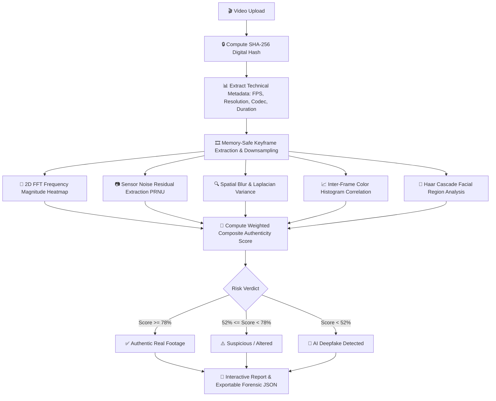

# 🛡️ VideoAuthenticator - AI Video & Deepfake Forensic Detection Platform

[](https://videoauthenticator-0elu.onrender.com)
[](https://www.python.org/)
[](https://www.djangoproject.com/)
[](https://opencv.org/)
[](LICENSE)

> **VideoAuthenticator** is an advanced AI video forensic authentication platform that analyzes digital video streams to detect **Deepfakes, AI-generated media (Sora, Runway Gen-2/3, Pika, Stable Diffusion, Kling, FaceSwap)** and distinguishes them from **Authentic Physical Camera Footage** in real time.

---

## 📌 What is VideoAuthenticator?

With the rapid explosion of photorealistic AI video generators (such as OpenAI Sora, Runway, Pika, Kling, and DeepFaceLab), distinguishing real camera recordings from fabricated synthetic media has become a critical challenge for journalism, law, security, and digital identity verification.

**VideoAuthenticator** solves this by performing multi-layer forensic analysis on video files. Instead of relying solely on black-box heuristics, it inspects digital artifacts left behind by AI generation tools — including **frequency domain grid patterns (2D FFT)**, **lack of hardware camera sensor noise (PRNU)**, **spatial facial over-smoothing**, and **temporal frame inconsistencies** — providing an instant, transparent credibility score and downloadable verification certificate.

### ⚡ Quick Summary (How It Works):
1. 📤 **Upload Any Video**: Drag and drop MP4, AVI, MOV, or MKV files.
2. 🔬 **Automated Forensic Scan**: The engine extracts keyframes and runs multi-layer computer vision & frequency spectrum checks.
3. 📊 **Instant Verdict & Report**: View the **Authenticity Score (0–100%)**, **AI Generation Likelihood**, interactive **FFT Heatmaps**, and export a verified **JSON Forensic Certificate**.

---

## 🌐 Live Production Demo
👉 **[https://videoauthenticator-0elu.onrender.com](https://videoauthenticator-0elu.onrender.com)**


---

## 🌟 Key Forensic Capabilities

### 1. 🤖 2D Fast Fourier Transform (FFT) Frequency Domain Spectrum
- Analyzes video frames in the frequency domain using 2D FFT.
- Detects the microscopic, high-frequency checkerboard grid artifacts and non-physical spectral decay signatures inherent to generative neural networks (GANs, Diffusion models, and autoregressive video generators).
- Generates a **colorized Jet Spectrum Heatmap** embedded in the forensic report.

### 2. 📷 Camera Sensor Noise (PRNU) & Residual Variance
- Extracts high-frequency residual noise patterns ($\sigma_{\text{noise}}$) via spatial filtering.
- Validates the presence of authentic **Photo Response Non-Uniformity (PRNU)** camera sensor noise, which is naturally present in real camera sensors but omitted by synthetic, over-smoothed AI generators.

### 3. 🔍 Spatial Blur & Facial Over-Smoothing Detection
- Calculates inter-frame **Laplacian variance** $\text{Var}(\Delta I)$.
- Detects synthetic skin smoothing, loss of micro-textures, face-swap blending seams, and unnatural sharpness fluctuations.

### 4. 🎞️ Inter-Frame Temporal Continuity & Warp Checking
- Performs multi-channel color histogram correlation across sequential sampled frames.
- Identifies temporal flickering, frame-splicing glitches, warping distortions, and face-swap boundary inconsistencies.

### 5. 🚨 Composite AI Likelihood % & Verdict Classification
- Outputs a weighted **Overall Authenticity Score** (0–100) and **AI Generation Probability %**.
- Categorizes each upload into three transparent verdicts:
  - 🚨 **`AI GENERATED VIDEO / DEEPFAKE DETECTED`** (`CRITICAL RISK`)
  - ⚠️ **`SUSPICIOUS / POTENTIALLY ALTERED VIDEO`** (`MEDIUM RISK`)
  - ✅ **`VERIFIED REAL CAMERA FOOTAGE`** (`LOW RISK`)

### 6. 🔐 Cryptographic Provenance (SHA-256 Digital Fingerprint)
- Generates an immutable **SHA-256 digital hash** of the uploaded video binary to prove chain-of-custody and prevent tampering.

### 7. 📄 Exportable Forensic JSON Certificates
- Enables one-click download of structured **Forensic Verification Certificates** containing full metadata, technical parameters, forensic sub-scores, and detected anomaly logs.

### 8. 🎨 Glassmorphic Dark UI & Interactive Analytics
- Sleek dark aesthetic with backdrop blur effects, animated risk meters, interactive filters (`All`, `Authentic`, `Suspicious`, `Deepfake`), real-time search, and video playback with forensic side-by-side comparisons.

---

## 🔬 Forensic Verification Architecture



---

## 🛡️ Forensic Metrics Matrix

| Forensic Metric | Analysis Methodology | Detected Anomalies |
| :--- | :--- | :--- |
| **FFT Frequency Spectrum** | 2D Fast Fourier Transform Magnitude Spectrum | High-frequency grid patterns from neural diffusion/GAN generators |
| **Sensor Noise Residual** | Gaussian residual noise extraction ($\sigma_{\text{noise}}$) | Missing physical camera sensor noise (PRNU), artificial smoothing |
| **Spatial Blur & Sharpness** | Laplacian Variance $\text{Var}(\Delta I)$ | AI facial over-smoothing, face-swap boundary blending artifacts |
| **Temporal Continuity** | Inter-frame color histogram correlation | Warp distortion, frame-to-frame flickering, splicing glitches |
| **Digital Provenance** | Cryptographic SHA-256 Hashing | Tampering detection, proof of integrity, chain of custody |

---

## 🛠️ Technology Stack

- **Backend Framework**: Python 3.10+, Django 5.2
- **Computer Vision & AI**: OpenCV (`opencv-python-headless`), NumPy, Pillow, Matplotlib, ImageIO
- **Production Server**: Gunicorn, WhiteNoise (Static assets)
- **Database**: SQLite3 (Local) / PostgreSQL (via `dj-database-url` & `psycopg2-binary`)
- **Frontend**: Modern Vanilla CSS (Glassmorphism), Semantic HTML5, JavaScript (ES6+), FontAwesome Icons
- **Deployment Platform**: Render (`render.yaml`, `build.sh`, `Procfile`)

---

## 📁 Repository Structure

```text
VideoAuthenticator/
├── render.yaml                  # Render Blueprint deployment configuration
├── Procfile                     # Gunicorn web process definition
├── requirements.txt             # Python dependencies
├── README.md                    # Project documentation
└── videoauth/                   # Django Project Root
    ├── build.sh                 # Cloud build script (migrations + collectstatic)
    ├── manage.py                # Django management script
    ├── db.sqlite3               # SQLite Database
    ├── media/                   # Uploaded media & forensic generated artifacts
    │   ├── video/               # Uploaded video files
    │   └── thumbnails/          # Generated keyframes & FFT spectrum heatmaps
    ├── static/                  # Static design assets
    │   └── css/style.css        # Glassmorphic CSS design system
    ├── templates/               # Global templates (base.html, login.html, register.html)
    ├── video/                   # Core Video Authentication Application
    │   ├── models.py            # Video schema with forensic scores & reports
    │   ├── views.py             # Dashboard, upload, report, export & auth views
    │   ├── utils.py             # Multi-layer CV & FFT forensic analysis engine
    │   ├── forms.py             # Video upload & registration forms
    │   ├── urls.py              # Application routing
    │   └── templates/video/     # Dashboard, upload & detail view templates
    └── videoauth/               # Django configuration
        ├── settings.py          # Production-ready Django settings
        ├── urls.py              # Master routing
        └── wsgi.py              # WSGI entrypoint
```

---

## ⚙️ Local Installation & Setup

### 1. Clone the Repository
```bash
git clone https://github.com/Ayush26-03/VideoAuthenticator.git
cd VideoAuthenticator/videoauth
```

### 2. Create and Activate a Virtual Environment
```bash
# Windows
python -m venv ..\.venv
..\.venv\Scripts\activate

# macOS / Linux
python3 -m venv ../.venv
source ../.venv/bin/activate
```

### 3. Install Dependencies
```bash
pip install -r requirements.txt
```

### 4. Run Database Migrations
```bash
python manage.py migrate
```

### 5. Create an Admin Account (Optional)
```bash
python manage.py createsuperuser
```

### 6. Start the Development Server
```bash
python manage.py runserver 127.0.0.1:8000
```
Open **[http://127.0.0.1:8000](http://127.0.0.1:8000)** in your browser!

---

## 🚀 Cloud Deployment (Render)

This repository is pre-configured for **Render** via `render.yaml` and `build.sh`.

### One-Click Blueprint Deployment:
1. Fork or clone this repository to your GitHub account.
2. Go to **[Render Dashboard](https://dashboard.render.com/)** $\rightarrow$ Click **New +** $\rightarrow$ **Blueprint**.
3. Select your repository `Ayush26-03/VideoAuthenticator`.
4. Render will automatically configure the build and start commands and deploy your application.

### Manual Web Service Configuration:
- **Root Directory:** `videoauth`
- **Environment:** `Python 3`
- **Build Command:** `./build.sh`
- **Start Command:** `gunicorn videoauth.wsgi:application --bind 0.0.0.0:$PORT --timeout 120`
- **Environment Variables:**
  - `PYTHON_VERSION`: `3.10.12`
  - `DEBUG`: `False`
  - `ALLOWED_HOSTS`: `*`
  - `CSRF_TRUSTED_ORIGINS`: `https://*.onrender.com`
  - `SECRET_KEY`: *(Generate a secure random string)*

---

## 📄 Example Forensic JSON Certificate

```json
{
  "file_name": "sample_clip.mp4",
  "file_hash_sha256": "4b227777d4dd1fc61c6f884f48641d02b4d121d3fd328cb08b5531fcacdabf8a",
  "overall_authenticity_score": 91.4,
  "ai_generation_probability": 8.6,
  "verification_status": "Authentic",
  "forensic_verdict": "VERIFIED REAL CAMERA FOOTAGE",
  "deepfake_risk_level": "LOW RISK",
  "spectrum_image_url": "/media/thumbnails/spectrum_1_sample_clip.mp4.jpg",
  "metrics": {
    "metadata_integrity": { "score": 95.0, "status": "Pass" },
    "spatial_blur_artifacts": { "score": 88.2, "status": "Pass" },
    "temporal_continuity": { "score": 92.0, "status": "Pass" },
    "sensor_noise_residuals": { "score": 90.5, "status": "Pass" }
  },
  "technical_summary": {
    "fps": 30.0,
    "frame_count": 300,
    "resolution": "1920x1080",
    "duration_sec": 10.0,
    "codec": "H264",
    "faces_detected": 1,
    "sampled_frames_count": 10
  },
  "anomalies_detected": [
    "No significant structural or facial anomalies detected. Video matches authentic camera hardware profiles."
  ]
}
```

---

## 📜 License

Distributed under the **MIT License**. See `LICENSE` for more information.

---

## 👤 Author & Maintainer

**Ayush Pandey**
- **GitHub**: [@Ayush26-03](https://github.com/Ayush26-03)
- **Project**: [VideoAuthenticator](https://github.com/Ayush26-03/VideoAuthenticator)